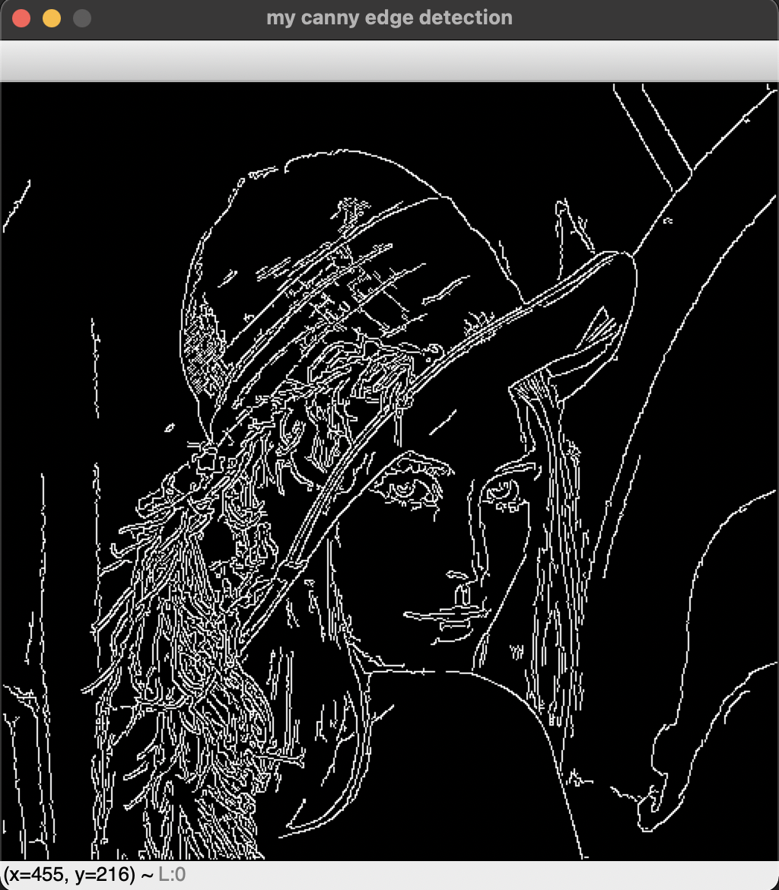
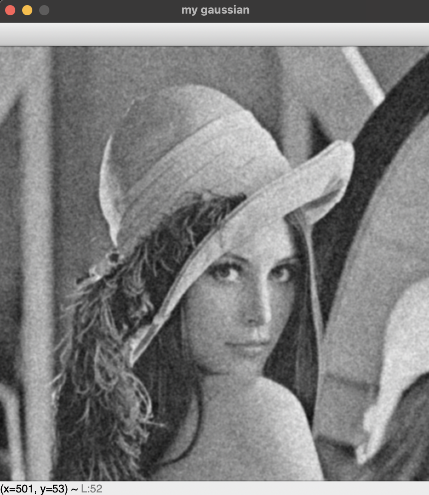
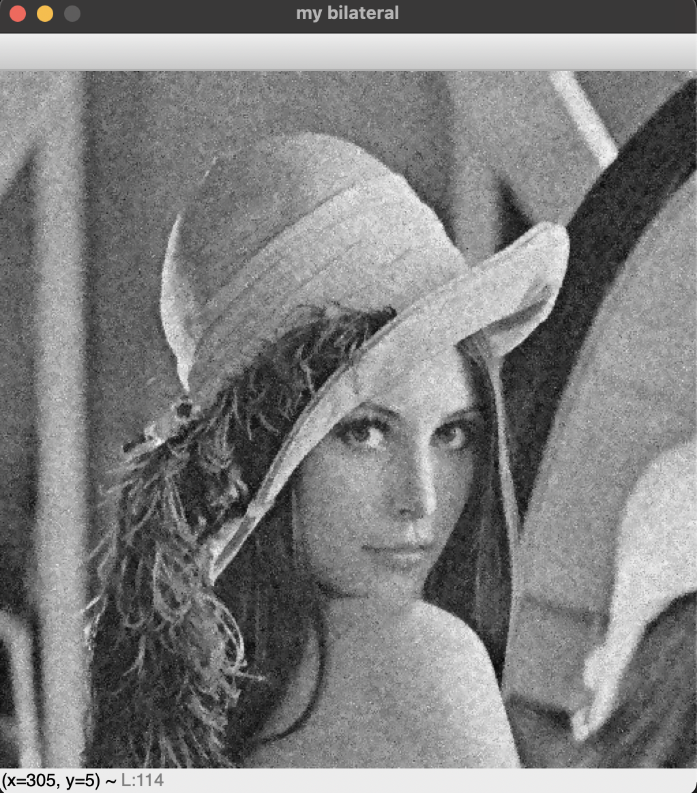
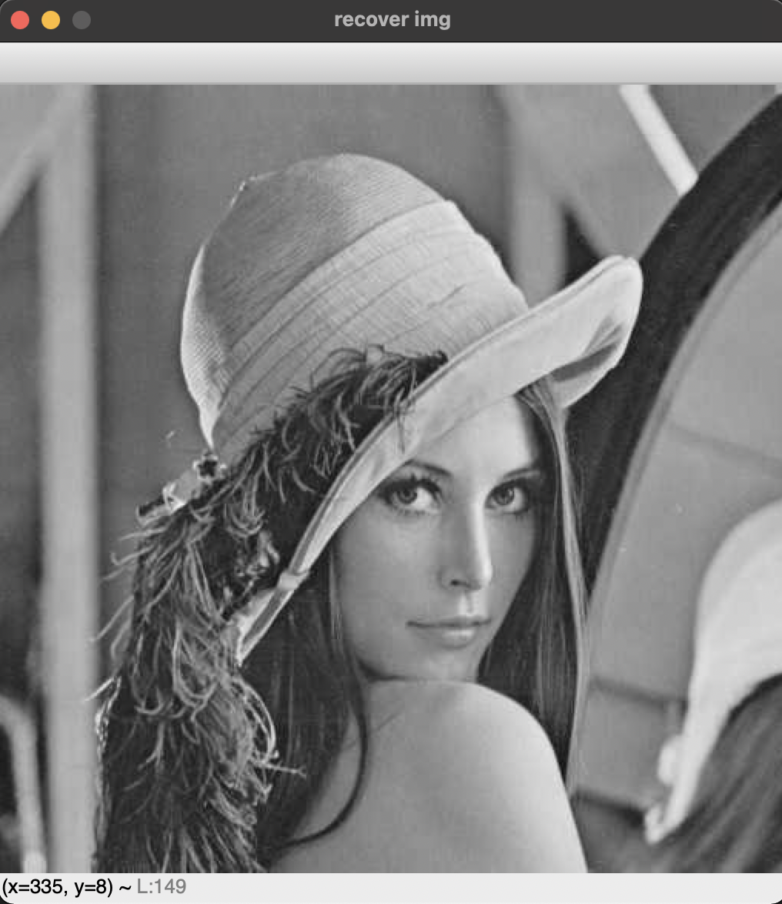

# Image-Processing

# 영상처리 과제 Repository

**사용 언어 : Python**
**사용 라이브러리 : Numpy, opencv**

## Notice.
**본 과제는 일부 opencv 라이브러리를 제외하면 순수하게 Numpy만을 사용하여 구현함**

## 주요 구현 과제 결과물  목록

### 1. Canny edge

### 2. Noise removal - Gaussian and Bilateral

### 3. JPEG Compression

